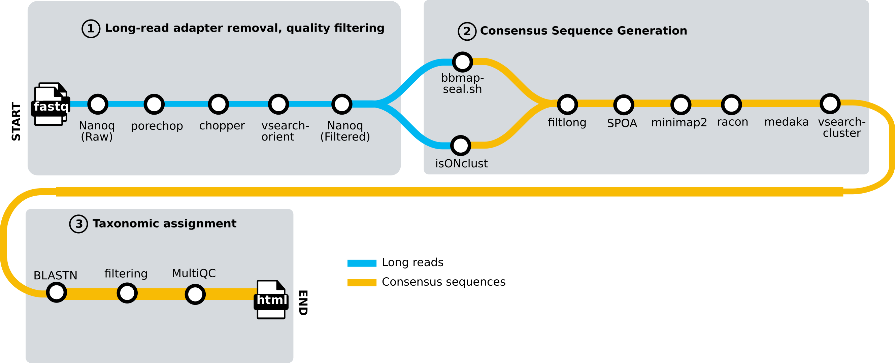

# PlantPathogenDiagnostics/metapathogen

[](https://github.com/PlantPathogenDiagnostics/metapathogen/actions/workflows/nf-test.yml)
[](https://github.com/PlantPathogenDiagnostics/metapathogen/actions/workflows/linting.yml)[](https://doi.org/10.5281/zenodo.XXXXXXX)
[](https://www.nf-test.com)

[](https://www.nextflow.io/)
[](https://github.com/nf-core/tools/releases/tag/3.3.2)
[](https://docs.conda.io/en/latest/)
[](https://www.docker.com/)
[](https://sylabs.io/docs/)
[](https://cloud.seqera.io/launch?pipeline=https://github.com/PlantPathogenDiagnostics/metapathogen)

## Introduction

**PlantPathogenDiagnostics/metapathogen** is a bioinformatics pipeline that generates consensus sequences with classification from amplicon data. It takes a samplesheet with FASTQ files from NanoPore sequencing as input performs quality control (QC), read clustering, consensus sequence generation, blast alignment, and produces a reference assignment and QC report.



1. Read preprocessing
   1. Read quality assessment
      1. Read quality before and after filtering ([`nanoq`](https://github.com/esteinig/nanoq))
   2. Read trimming and filtering
      1. Remove adapters([`porechop`](https://github.com/rrwick/Porechop)) 
      2. Length and quality filter ([`chopper`](https://github.com/wdecoster/chopper))
   3. Orient reads
      1. Orient reads in accordance with reference database ([`vsearch-orient`](https://github.com/torognes/vsearch))
2. Read clustering
   1. Cluster reads by shared kmer with reference database ([`seal.sh`](https://github.com/BioInfoTools/BBMap/blob/master/sh/seal.sh))
   2. Secondary clustering by read similarity ([`isONclust`](https://github.com/ksahlin/isONclust))
   3. BP cutoff for making consensus sequence ([`filtlong`](https://github.com/rrwick/Filtlong))
3. Build Consensus Sequence
   1. Generate consensus sequence for each cluster ([`Spoa`](https://github.com/rvaser/spoa))
   2. Align reads within clusters ([`minimap2`](https://github.com/lh3/minimap2))
   3. Build consensus resuence ([`racon`](https://github.com/isovic/racon))
   4. Polish consensus sequence ([`medaka`](https://github.com/nanoporetech/medaka))
   5. Remove redundant sequences ([`vsearch-cluster``](https://github.com/torognes/vsearch))
4.	Taxonomic assignment
	1. Taxonomic classification ([`BLASTn`](https://blast.ncbi.nlm.nih.gov/Blast.cgi))
5.	Summary consensus sequences and assignments in excel workbook (python script)


## Quick Usage

> [!NOTE]
> If you are new to Nextflow and nf-core, please refer to [this page](https://nf-co.re/docs/usage/installation) on how to set-up Nextflow. Make sure to [test your setup](https://nf-co.re/docs/usage/introduction#how-to-run-a-pipeline) with `-profile test` before running the workflow on actual data.


First, prepare a samplesheet with your input data that looks as follows:

`samplesheet.csv`:

```csv
sample,fastq_1
CONTROL_REP1,sample1.fastq.gz
```

Each row represents a fastq file.

You must also supply a reference fasta database of amplicon sequences of potential taxa.

Now, you can run the pipeline using:

```bash
nextflow run PlantPathogenDiagnostics/metapathogen \
   -profile <docker/singularity/.../institute> \
   --input samplesheet.csv \
   --outdir <OUTDIR> \
   --reference <fasta of ref sequences>
```

> [!WARNING]
> Please provide pipeline parameters via the CLI or Nextflow `-params-file` option. Custom config files including those provided by the `-c` Nextflow option can be used to provide any configuration _**except for parameters**_; see [docs](https://nf-co.re/docs/usage/getting_started/configuration#custom-configuration-files).

## Full Usage

```
Typical pipeline command:

  nextflow run PlantPathogenDiagnostics/metapathogen -profile <docker/singularity/.../institute> --input samplesheet.csv --outdir <OUTDIR>

--skip_qc                       [boolean]
--show_hidden                   [boolean]         Show all hidden parameters in the help message. This needs to be used in combination with `--help` or `--help_full`.
--help                          [boolean, string] Show the help message for all top level parameters. When a parameter is given to `--help`, the full help message of that parameter will be printed.
--help_full                     [boolean]         Show the help message for all non-hidden parameters.

Reference Database
  --reference                   [string] Path to fasta file of references

Read QC options
  --min_length                  [number] Minimum read length used for building consensus sequences. [default: 500]
  --min_quality                 [number] Minimum read quality used for building consensus sequences. [default: 10]
  --adaptertrimming_tool        [string]  (accepted: porechop, porechop_abi) [default: porechop]
  --max_length                  [number] Maximum read length used for building consensus sequences. [default: 1000]

BLASTn filtering cutoffs
  --min_pident                  [number] Minimum percent identity to the reference. [default: 90]
  --min_ref_cov                 [number] Minimum percent coverage to the reference. [default: 50]
  --max_con_len                 [number] Maximum length of consensus sequence. [default: 1000]
  --max_mismatch                [number] Maximum number of nucleotide mismatches with the reference. [default: 11]

Input/output options
  --input                       [string] Path to comma-separated file containing information about the samples in the experiment.
  --output                      [string] Name of the summary excel file.
  --outdir                      [string] The output directory where the results will be saved. You have to use absolute paths to storage on Cloud infrastructure.
  --email                       [string] Email address for completion summary.
  --multiqc_title               [string] MultiQC report title. Printed as page header, used for filename if not otherwise specified.

Generic options
  --multiqc_methods_description [string] Custom MultiQC yaml file containing HTML including a methods description.

```

## Credits

PlantPathogenDiagnostics/metapathogen was originally written by Schyler O. Nunziata.

We thank the following people for their extensive assistance in the development of this pipeline: Subodh K. Srivastava, Vanina Castroagudin, Eric Newberry, Yazmin Rivera, and Gloria Abad


## Contributions and Support

If you would like to contribute to this pipeline, please see the [contributing guidelines](.github/CONTRIBUTING.md).

## Citations

An extensive list of references for the tools used by the pipeline can be found in the [`CITATIONS.md`](CITATIONS.md) file.

This pipeline uses code and infrastructure developed and maintained by the [nf-core](https://nf-co.re) community, reused here under the [MIT license](https://github.com/nf-core/tools/blob/main/LICENSE).

> **The nf-core framework for community-curated bioinformatics pipelines.**
>
> Philip Ewels, Alexander Peltzer, Sven Fillinger, Harshil Patel, Johannes Alneberg, Andreas Wilm, Maxime Ulysse Garcia, Paolo Di Tommaso & Sven Nahnsen.
>
> _Nat Biotechnol._ 2020 Feb 13. doi: [10.1038/s41587-020-0439-x](https://dx.doi.org/10.1038/s41587-020-0439-x).
